# Neurog2 Project - scRNA-seq Analysis

This project focuses on the single-cell RNA sequencing (scRNA-seq) analysis of samples related to **Neurog2** expression at different stages and control. The goal is to study how MG cells develope to other cells. 

## Samples

| Sample Name           | Description          |
|-----------------------|----------------------|
| 5 weeks Neurog2_9SA   | TH1_GFP_mScarlet3    |
| 2 months control      | TH2_GFP_mScarlet3    |
| 2 months Neurog2_9SA  | TH3_GFP_mScarlet3    |

## Analysis Workflow

The analysis was performed using [Scanpy](https://scanpy.readthedocs.io/en/stable/), a scalable toolkit for analyzing single-cell gene expression data. The workflow included:


### Preprocessing 

1. **Merge Multiple Samples**
   Multiple `AnnData` objects are combined into one using their sample names as labels. This enables joint analysis while preserving sample identity.

2. **Identify Mitochondrial Genes**
   Genes that start with `"mt-"` are flagged as mitochondrial genes, which are important indicators of cell stress or damage.

3. **Calculate Quality Control (QC) Metrics**
   Standard QC metrics are computed for each cell:

   * `n_genes_by_counts`: Number of genes detected
   * `total_counts`: The total number of UMIs observed per cell
   * `pct_counts_mt`: Percent of transcripts from mitochondrial genes

4. **Visualize QC Metrics (Before Filtering)**
   Violin plots are used to visualize the distribution of these metrics to help identify low-quality cells.

5. **Filter Out Low-Quality Cells**
   Cells are removed if they have:

   * Too few or too many detected genes (e.g. <800 or >8000)
   * Extremely low or high total transcript counts
   * High mitochondrial content (e.g. >25%), indicating cell stress

6. **Further Filtering**

   * Cells with fewer than 100 genes are removed
   * Genes found in fewer than 3 cells are excluded

7. **Visualize QC Metrics (After Filtering)**
   Another set of violin plots is generated to assess the impact of filtering on the dataset.

8. **Save the Processed Data**
   The cleaned and filtered data is saved as an `.h5ad` file for downstream analysis.

---

## Figures

### 1. UMAP Visualization
  
UMAP plot colored by sample, showing clustering and distribution of single cells from different conditions.


## Per sample UMAP 


###  Scanpy QC Metrics — Quick Overview

#### 🔹 `n_genes_by_counts`

* **Definition**: Number of genes with **non-zero counts** in each cell.
* **Use**: Helps filter out cells with too few expressed genes (often poor quality or empty droplets).

#### 🔹 `total_counts`

* **Definition**: Total **number of counts (UMIs or reads)** in a cell.
* **Use**: Indicates cell complexity or sequencing depth. Very low values may indicate damaged cells or low capture.

#### 🔹 `pct_counts_mt`

* **Definition**: Percentage of counts from **mitochondrial genes** (e.g., genes starting with `mt-` in mouse or `MT-` in human).
* **Use**: High percentages may indicate **cell stress or apoptosis**; often used to filter out low-quality cells.


  
Violin plots displaying quality control metrics such as number of genes detected per cell, total counts, and percentage of mitochondrial gene expression.

## Filtering Criteria

Quality filtering was applied to remove low-quality cells and potential doublets. Cells were retained only if they met all the following criteria:

- Number of genes detected per cell between **800 and 8000**
- Total counts per cell between **1200 and 30000**
- Percentage of mitochondrial gene counts less than **25%**

This filtering step ensures removal of dead or dying cells and technical artifacts to improve downstream analysis quality.


### Additional Analysis Figure
  


## Number of cells per sample 

| Sample              | Cell Count |
|---------------------|------------|
| Neurog2_9SA_5weeks  | 27,732     |
| Neurog2_9SA_2mo     | 11,486     |
| control_2mo         | 9,701      |


## Clustering 

1. **Load the Data**
   A preprocessed `AnnData` object is loaded from disk.

2. **Normalize and Transform**

   * Normalize gene expression values 
   * Apply a logarithmic transformation to stabilize variance across genes.

3. **Feature Selection**

   * Identify the top 2,000 highly variable genes using the Seurat method. These are the most informative genes for downstream analysis.

4. **Scale the Data**

   * Standardize the expression values (mean = 0, variance = 1).
   * Clip extreme values to a maximum of 10 to reduce the impact of outliers.

5. **Dimensionality Reduction (PCA)**

   * Perform Principal Component Analysis to reduce data dimensionality and denoise the dataset.

6. **Construct the Neighborhood Graph**

   * Build a k-nearest neighbors graph based on PCA to capture the local structure of the data.

7. **UMAP Embedding**

   * Compute a 2D UMAP embedding for visualization of the dataset’s structure.

8. **Visualize UMAP by Sample**

   * Generate a UMAP plot where cells are colored by their sample origin.
   * Count how many cells belong to each sample.

9. **Per-Sample UMAP Plots**

   * Loop through each sample and generate a separate UMAP plot showing only the cells from that sample.

10. **Visualize Predicted Doublets**

* Plot a UMAP colored by predicted doublet labels and doublet scores to inspect doublet detection results.


### Marker Gene UMAP Plots
Below are the UMAP visualizations of marker gene expression across clusters. These are auto-generated from your data and saved in the figures/ directory.


### Initial Clustering 


### Marker Gene UMAP Plots
Below are the UMAP visualizations of marker gene expression across clusters. These are auto-generated from your data and saved in the figures/ directory.


### QC per Clsuter 


### Remove clusters 

| ID | Cell Type           |
|-----|--------------------|
| 7   | Bad Cells          |
| 8   | Microglia          |
| 11  | Bad Cells          |
| 20  | Microglia          |
| 28  | Monocyte           |
| 33  | RPE/Pax2           |
| 34  | SMC                |

then we reclustered and replot the marker genes as below: 


### UMAP

 


### Per sample UMAP 

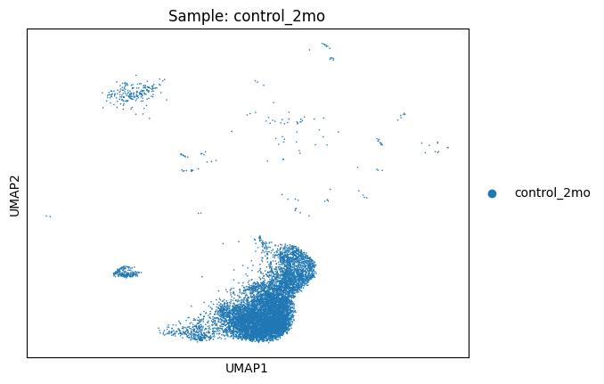


## Number of cells per sample 

| Sample              | Cell Count |
|---------------------|------------|
| Neurog2_9SA_5weeks  | 23,370     |
| Neurog2_9SA_2mo     | 10,115     |
| control_2mo         | 8,674      |

---

## Doublet Detection using `DoubletDetection`

A doublet is an artifact where two cells are captured and sequenced together, but incorrectly treated as one. Unlike `Scrublet`, which can operate effectively on clustered or preprocessed `AnnData` objects, the `DoubletDetection` tool is more sensitive to data structure and expects the **original, unclustered** `AnnData` object. Running it on a processed or subsetted object may yield suboptimal or misleading results.

In the workflow, we applied `DoubletDetection` to the original data (`adata`) to ensure it captures the full transcriptomic diversity and avoids artifacts introduced during clustering.

After running `DoubletDetection`, predicted doublets and doublet scores were stored in `adata.obs` under the keys:
- `predicted_doublet`: Boolean flag indicating whether each cell is a predicted doublet.
- `doublet_score`: Confidence score associated with doublet prediction.

The results were visualized using UMAP, colored by both prediction and score:

###  DoubletDetection Workflow

####  Data Preprocessing
- Input is a raw (or filtered) gene expression matrix.
- May optionally normalize, filter, and log-transform the data.

####  Synthetic Doublet Generation
- Creates artificial doublets by randomly pairing real cells.
- Averages their gene expression profiles to simulate doublets.

####  Clustering with Real + Synthetic Data
- Combines real and synthetic cells.
- Performs dimensionality reduction (typically **PCA**).
- Applies unsupervised clustering (usually **Phenograph**, a graph-based algorithm).

####  Voting Mechanism via Multiple Runs (Ensemble)
- Repeats the clustering multiple times (default: **50 runs**).
- Tracks how often each real cell clusters with synthetic doublets.
- Cells that frequently cluster with synthetic doublets are flagged as potential doublets.

####  Thresholding & Output
- Assigns a **doublet probability score** to each cell.
- Applies a threshold (user-defined or default) to classify each cell as a **doublet** or **singlet**.


### Doublet Scores and Conversion

   
   
   


###  Understanding `doublet_score` Thresholds

The `doublet_score` typically ranges from **0 to 1**

Your filter in the code:

```python
combined_adata = combined_adata[combined_adata.obs['doublet_score'] <= threshold]
```

This means you're **keeping** cells with `doublet_score <= threshold`.


###  Interpretation of Threshold:

* **Higher threshold** (e.g., `0.9`)
  🔹 You keep **more** cells
  🔹 Less doublets are removed

* **Lower threshold** (e.g., `0.4`) 
  🔹 You keep **fewer** cells
  🔹 More potential doublets are removed 


### Doublet Removal at Threshold 0.9 


### UMAP after  clustering 

 

### UMAP after doublet removal at threshold 0.9 
 


### Marker Genes UMAP after doublet removal at threshold 0.9 


### Doublet removal using 0.8 threshold 

### UMAP after  clustering 


### UMAP after doublet removal at threshold 0.8 


### Marker Genes UMAP after doublet removal at threshold 0.8  


### Pre filtering QC


#### How we filtered 
```python
adata = adata[
    (adata.obs['n_genes_by_counts'] > 800) &
    (adata.obs['n_genes_by_counts'] < 8000) &
    (adata.obs['total_counts'] > 1200) &
    (adata.obs['total_counts'] < 30000) &
    (adata.obs['pct_counts_mt'] < 25),
    :
]

```

### Post filtering QC

 


### QC per Cluster 


### UMAP per Sample 


### Remove clusters 

| ID | Cell Type           |
|-----|--------------------|
| 7   | Bad rod            |
| 8   | Microglia          |
| 18  | Microglia          |
| 27  | Monocyte           |
| 32  | Astrocyte          |
| 33  | Smooth muscle cells|
| 15  | Likely doublets?   |
| 24  | Likely doublets?   |

### Then reCluster 

### Different resolutions 

#### Resolution = 1.4


#### Resolution = 2.0


#### Resolution = 2.5


#### Resolution = 3.0


#### Resolution = 3.5


#### Resolution = 4.0


### We will stick to resolution 2.0 

#### Resolution = 2.0


#### UMAP of marker genes  

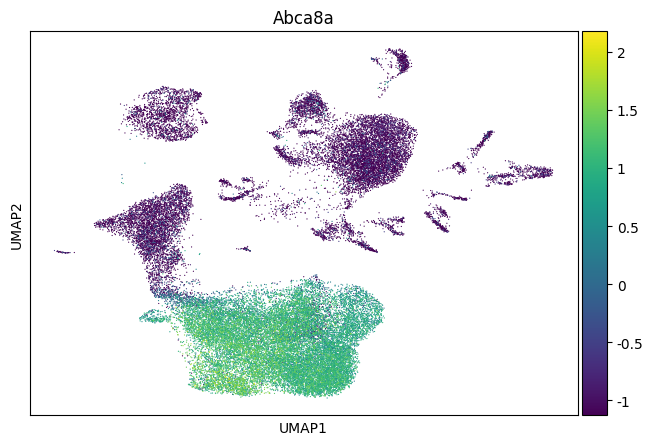
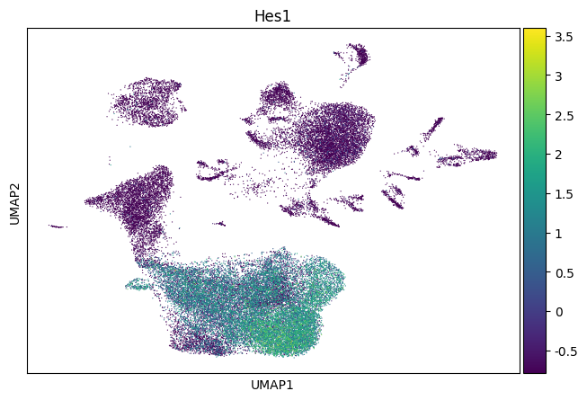
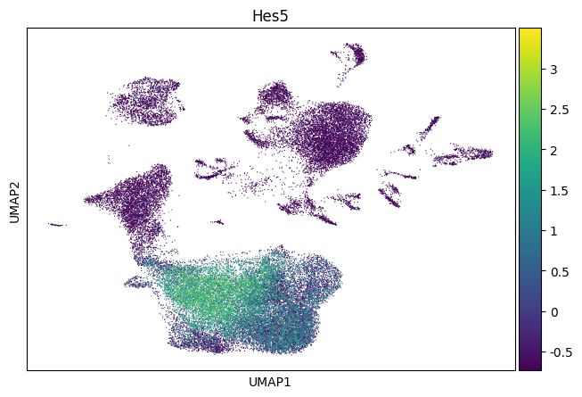


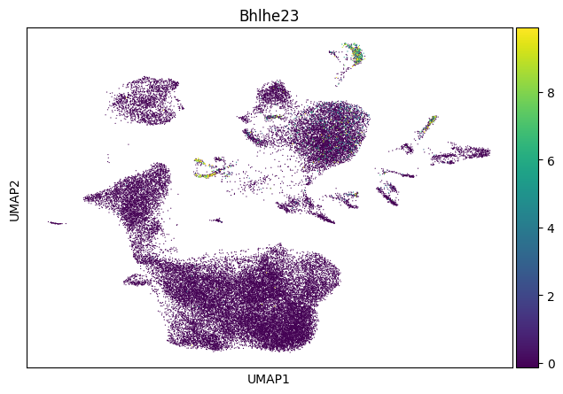


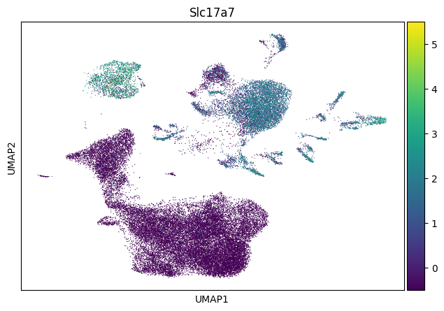


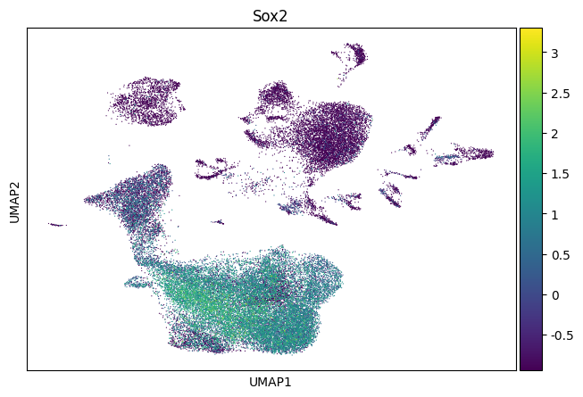


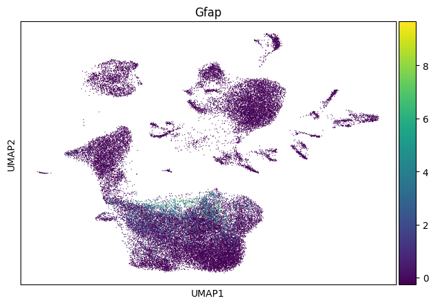


### Dot plot for major celltypes and marker genes 


## Annotations 

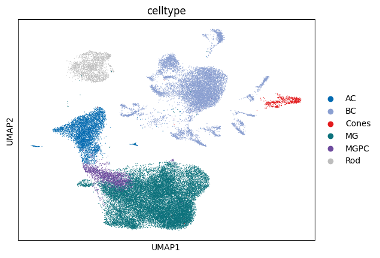
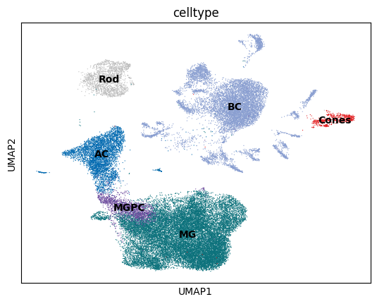
## !!!! TO BE FIXED 


## UMAP per sample 


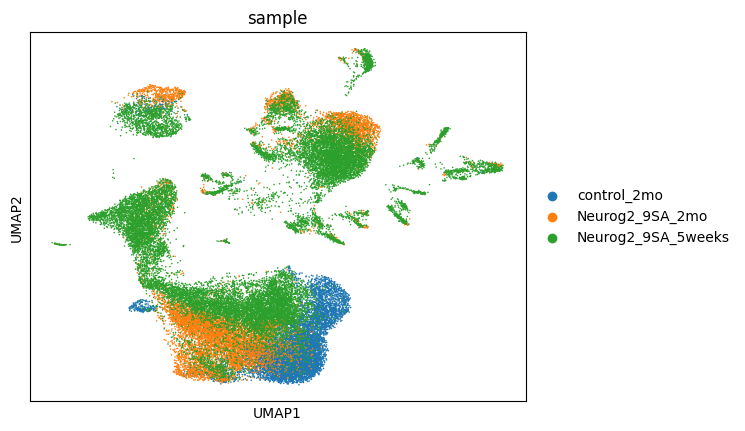

## Cell Ratio 

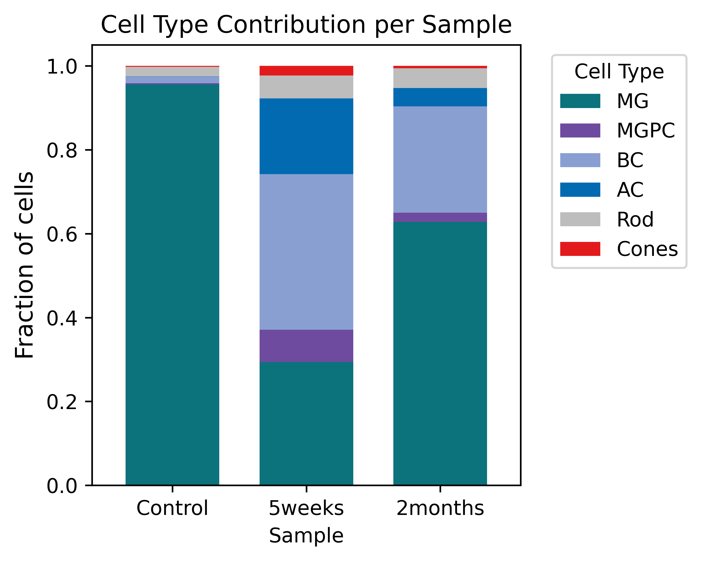


#### Gene Expression Analysis 

### 🎯🎯 Using t-test method: according to scanpy documentation, logfold change is calculated when t-test methods are used 


✅ ✅ [t-test Gene Expressions](https://docs.google.com/spreadsheets/d/19YY4ErDH-bcsntzXxDzc-D7wrKbziCzvH7x4rav1SbQ/edit?usp=sharing)


### 🎯🎯 Using default parameters of scanpy which doesn't calculate log foldchange

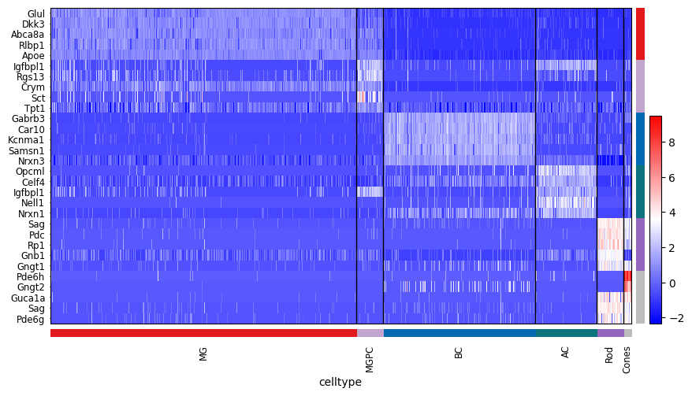
 
✅ ✅ [Default Parameters Gene Expressions](https://docs.google.com/spreadsheets/d/15ME9IKEDl7INO-U6jz7JE6d_yVFePF824eoymJG3QWE/edit?usp=sharing) 


### 🎯🎯 Using Wilcoxon method 

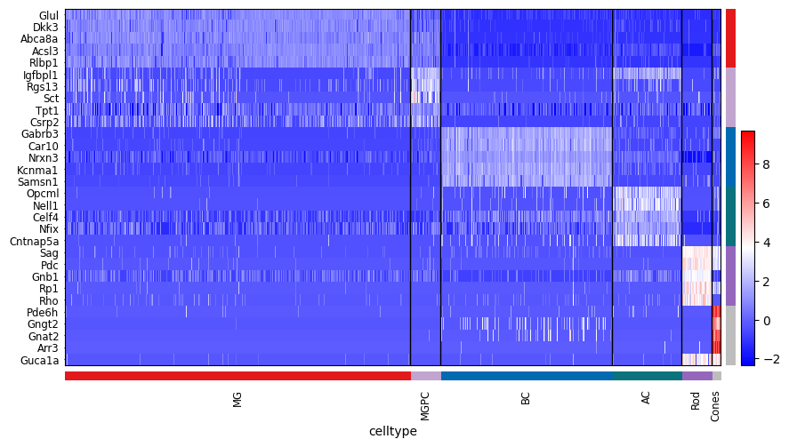


✅ ✅ [Wilcoxon Gene Expressions](https://docs.google.com/spreadsheets/d/1Xkz7XOfQqkARZs5gnu4-vR8OwBl62RIJ0cb3jYEn1oQ/edit?usp=sharing)


### 🎯🎯 Using T-test Control vs treatments 

 

✅ ✅ [ttest Gene Expressions](https://docs.google.com/spreadsheets/d/1DGXnW9RvCnNbShXm3ecENHvq8_y57AAPmCFAiawWzWM/edit?usp=sharing)


### 🎯🎯 Using Scanpy default parameters Control vs treatments using MG only


✅ ✅ [Default Gene Expressions](https://docs.google.com/spreadsheets/d/1Svw2Cc_LFwLNCNnfkRx8EegpttJcuUjn00mHoSuPZbU/edit?usp=sharing)


### 🎯🎯 Using t-test Control vs treatments 


✅ ✅ [ttest Gene Expressions](https://docs.google.com/spreadsheets/d/15lF52EWJKENZb8dBTOEYmIaYLp0NJFJTW5XGaMbD4EA/edit?usp=sharing)


### 🎯🎯 Using Wilcoxon Control vs treatments 


✅ ✅ [Wilcoxon Gene Expressions](https://docs.google.com/spreadsheets/d/1MV_jJk67ma8oEg4DDRkRBfIscvdIokmLa2N90W27-a8/edit?usp=sharing)


## Filter genes expressed less than 10% before proceeding with the analysis 
### Using t-test 
#### Look at `expressionG10.py` Python Script

 

✅ ✅ [ttest Gene Expressions](https://docs.google.com/spreadsheets/d/1B6B6qDTJoKtObiHOSZRXomW-1GvsQnACPcZWqNaShXg/edit?usp=sharing)


# ✨✨✨ Running PyScenic for transcription factors network 

### ✅ Loom File Summary

**Basic Info:**  
- Shape (genes × cells): **(2354, 44755)**  

**🧬 Row Attributes (Gene metadata):**  
- Attributes: `['Gene']`  
- Example gene names: `['Rgs20', 'Adhfe1', 'Ppp1r42', 'Prex2', 'Sbspon']`  

**🧫 Column Attributes (Cell metadata):**  
- Attributes: `['CellID', 'nGene', 'nUMI']`  
- Example CellIDs: `['AAACCAAAGCCATACA-1', 'AAACCCGCAATCCGTC-1', 'AAACCCGCATCACTGC-1', 'AAACCCGCATCGTACC-1', 'AAACCCTGTTGCTGTG-1']`  

**🔢 Expression Matrix Summary:**  
- Shape: **(44755, 2354)**  
- Data type: `float32`  
- Non-zero entries: **105,353,270**


## How to run Snakemake 

For dry run to check everything before actual run:

    snakemake -j1 -p --configfile config.yaml -n

For Actual run:

    snakemake -j1 -p --configfile config.yaml


## References

- **Scanpy**  
  Wolf, F. A., Angerer, P., & Theis, F. J. (2018).  
  *Scanpy: large-scale single-cell gene expression data analysis*. Genome Biology, 19(1), 15.  
  https://doi.org/10.1186/s13059-017-1382-0

- **Scrublet**  
Wolock, S. L., Lopez, R., & Klein, A. M. (2019).  
*Scrublet: Computational Identification of Cell Doublets in Single-Cell Transcriptomic Data*. Cell Systems, 8(4), 281–291.e9.  
https://doi.org/10.1016/j.cels.2018.11.005

- **DoubletDetection**  
  Gayoso, A., Shor, J., Carr, A. J., & Yosef, N. (2019).  
  *DoubletDetection: Computational doublet detection in single-cell RNA sequencing data using boosting algorithms*.  
  [GitHub Repository](https://github.com/JonathanShor/DoubletDetection)  
  *(No peer-reviewed publication; software citation based on GitHub authorship.)*


