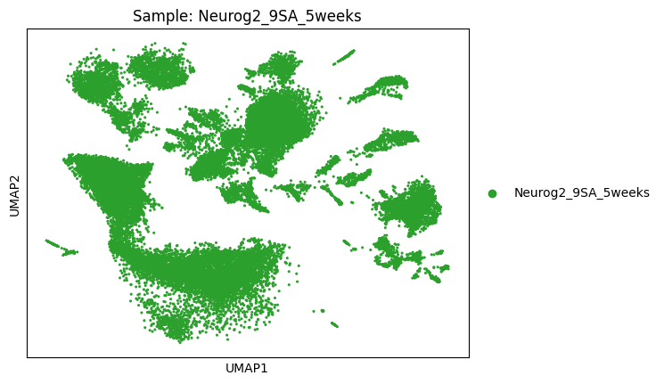
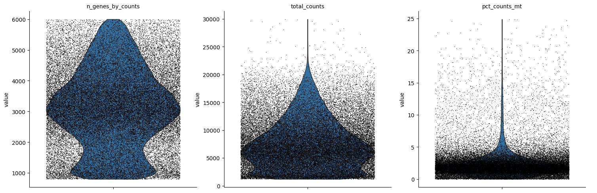

# Neurog2 Project - scRNA-seq Analysis

This project focuses on the single-cell RNA sequencing (scRNA-seq) analysis of samples related to **Neurog2** expression at different developmental stages and controls. The goal is to understand the cellular heterogeneity and transcriptional changes associated with Neurog2 in specific neuronal populations.

## Samples

| Sample Name           | Description          |
|-----------------------|----------------------|
| 5 weeks Neurog2_9SA   | TH1_GFP_mScarlet3    |
| 2 months control      | TH2_GFP_mScarlet3    |
| 2 months Neurog2_9SA  | TH3_GFP_mScarlet3    |

## Analysis Workflow

The analysis was performed using [Scanpy](https://scanpy.readthedocs.io/en/stable/), a scalable toolkit for analyzing single-cell gene expression data. The workflow included:

- Reading and normalizing raw data
- Identifying highly variable genes
- Scaling data
- Performing PCA and neighborhood graph calculation
- Computing UMAP embeddings for visualization
- Quality control and visualization

## Figures

### 1. UMAP Visualization
  
UMAP plot colored by sample, showing clustering and distribution of single cells from different conditions.

## Per sample UMAP 

### 2. Quality Control Violin Plot
  
Violin plots displaying quality control metrics such as number of genes detected per cell, total counts, and percentage of mitochondrial gene expression.

### 3. Additional Analysis Figure
  

## Filtering Criteria

Quality filtering was applied to remove low-quality cells and potential doublets. Cells were retained only if they met all the following criteria:

- Number of genes detected per cell between **800 and 8000**
- Total counts per cell between **1200 and 30000**
- Percentage of mitochondrial gene counts less than **25%**

This filtering step ensures removal of dead or dying cells and technical artifacts to improve downstream analysis quality.

## Number of cells per sample 

| Sample              | Cell Count |
|---------------------|------------|
| Neurog2_9SA_5weeks  | 27,732     |
| Neurog2_9SA_2mo     | 11,486     |
| control_2mo         | 9,701      |

### 4. Clustering 

## Marker Gene UMAP Plots
Below are the UMAP visualizations of marker gene expression across clusters. These are auto-generated from your data and saved in the figures/ directory.

## QC per Clsuter 

### 5. Removing low quality clustering and Reclustering 

We removed low quality clusters number:  ['7', '8', '11', '20', '28', '33', '34']

then we reclustered and replot the marker genes as below: 

## QC per Clsuter 

## Number of cells per sample 

| Sample              | Cell Count |
|---------------------|------------|
| Neurog2_9SA_5weeks  | 23,370     |
| Neurog2_9SA_2mo     | 10,115     |
| control_2mo         | 8,674      |

---

*Generated with Scanpy for single-cell RNA-seq analysis.*

