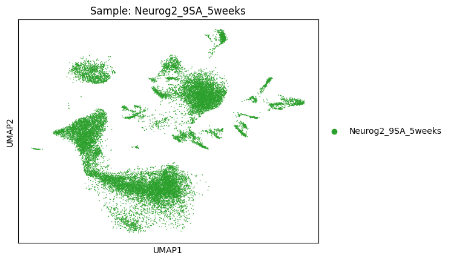
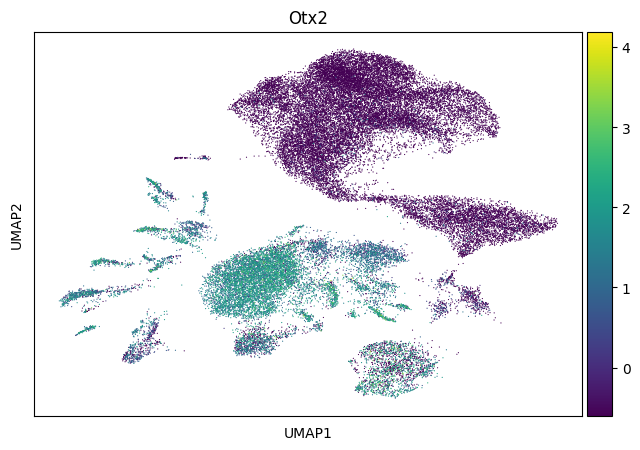

# Neurog2 Project - scRNA-seq Analysis

This project focuses on the single-cell RNA sequencing (scRNA-seq) analysis of samples related to **Neurog2** expression at different developmental stages and controls. The goal is to understand the cellular heterogeneity and transcriptional changes associated with Neurog2 in specific neuronal populations.

## Samples

| Sample Name           | Description          |
|-----------------------|----------------------|
| 5 weeks Neurog2_9SA   | TH1_GFP_mScarlet3    |
| 2 months control      | TH2_GFP_mScarlet3    |
| 2 months Neurog2_9SA  | TH3_GFP_mScarlet3    |

## Analysis Workflow

The analysis was performed using [Scanpy](https://scanpy.readthedocs.io/en/stable/), a scalable toolkit for analyzing single-cell gene expression data. The workflow included:

- Reading and normalizing raw data
- Identifying highly variable genes
- Scaling data
- Performing PCA and neighborhood graph calculation
- Computing UMAP embeddings for visualization
- Quality control and visualization

## Figures

### 1. UMAP Visualization
  
UMAP plot colored by sample, showing clustering and distribution of single cells from different conditions.

## Per sample UMAP 

### 2. Quality Control Violin Plot
  
Violin plots displaying quality control metrics such as number of genes detected per cell, total counts, and percentage of mitochondrial gene expression.

### 3. Additional Analysis Figure
  

## Filtering Criteria

Quality filtering was applied to remove low-quality cells and potential doublets. Cells were retained only if they met all the following criteria:

- Number of genes detected per cell between **800 and 8000**
- Total counts per cell between **1200 and 30000**
- Percentage of mitochondrial gene counts less than **25%**

This filtering step ensures removal of dead or dying cells and technical artifacts to improve downstream analysis quality.

## Number of cells per sample 

| Sample              | Cell Count |
|---------------------|------------|
| Neurog2_9SA_5weeks  | 27,732     |
| Neurog2_9SA_2mo     | 11,486     |
| control_2mo         | 9,701      |

### 4. Clustering 

## Marker Gene UMAP Plots
Below are the UMAP visualizations of marker gene expression across clusters. These are auto-generated from your data and saved in the figures/ directory.

## QC per Clsuter 

### 5. Removing low quality clustering and Reclustering 

We removed low quality clusters number:  ['7', '8', '11', '20', '28', '33', '34']

then we reclustered and replot the marker genes as below: 

## UMAP

 

## Per sample UMAP 

## QC per Cluster 

## Number of cells per sample 

| Sample              | Cell Count |
|---------------------|------------|
| Neurog2_9SA_5weeks  | 23,370     |
| Neurog2_9SA_2mo     | 10,115     |
| control_2mo         | 8,674      |

---

## Doublet Detection with Scrublet

We are using **Scrublet**, a Python-based tool, to identify and remove potential doublets from our single-cell RNA-seq dataset.

## Understanding Doublet Scores in Scrublet

**Doublet scores in Scrublet** quantify how likely each cell is to be a **doublet**, based on how similar its gene expression profile is to simulated doublets.

---

### 🔍 In Detail

#### What is a Doublet?

A **doublet** occurs when **two cells are captured in the same droplet** during single-cell RNA sequencing. Their RNA is sequenced as if it's from one cell, producing a mixed transcriptome. This can distort downstream analyses such as clustering, dimensionality reduction, and marker gene identification.

---

### How Scrublet Works

1. **Simulates Doublets**  
   Scrublet generates **synthetic doublets** by randomly combining gene expression profiles from real cells.

2. **Embedding**  
   It runs **PCA** on both the real and synthetic cells to embed them in the same low-dimensional space.

3. **Scoring**  
   For each real cell, Scrublet calculates a **doublet score** based on its **proximity to simulated doublets** in PCA space.

---

### Interpreting the Scores

- **Doublet score range**: Typically between **0 and 1**.
- **High score (~0.5–1.0)**:  
  The cell is very similar to simulated doublets → likely a **true doublet**.
- **Low score (~0–0.2)**:  
  The cell resembles real singlets → likely a **true singlet**.

---

### Threshold for Calling Doublets

Scrublet tries to automatically find a **threshold** where the doublet score distribution separates singlets from doublets. We can:

-  Let Scrublet pick the threshold automatically (default)
- ✏️ Manually adjust the threshold based on score distribution plots

## Doublet Scores Distribution  

## Doublet vs Singlet UMAP using default threshold = 0.4  

## Doublet vs Singlet UMAP using threshold = 0.1 

## Doublet vs Singlet UMAP using threshold = 0.18 

## Doublet vs Singlet UMAP using threshold = 0.15 

## Doublet Detection using `DoubletDetection`

Unlike `Scrublet`, which can operate effectively on clustered or preprocessed `AnnData` objects, the `DoubletDetection` tool is more sensitive to data structure and expects the **original, unclustered** `AnnData` object. Running it on a processed or subsetted object may yield suboptimal or misleading results.

In the workflow, we applied `DoubletDetection` to the original data (`adata`) to ensure it captures the full transcriptomic diversity and avoids artifacts introduced during clustering.

After running `DoubletDetection`, predicted doublets and doublet scores were stored in `adata.obs` under the keys:
- `predicted_doublet`: Boolean flag indicating whether each cell is a predicted doublet.
- `doublet_score`: Confidence score associated with doublet prediction.

The results were visualized using UMAP, colored by both prediction and score:

## Clustering after Doublet Detection using 

## Marker Gene UMAP Plots 

## How to run Snakemake 

For dry run to check everything before actual run:

    snakemake -j1 -p --configfile config.yaml -n

For Actual run:

    snakemake -j1 -p --configfile config.yaml

## References

- **Scanpy**  
  Wolf, F. A., Angerer, P., & Theis, F. J. (2018).  
  *Scanpy: large-scale single-cell gene expression data analysis*. Genome Biology, 19(1), 15.  
  https://doi.org/10.1186/s13059-017-1382-0

- **Scrublet**  
Wolock, S. L., Lopez, R., & Klein, A. M. (2019).  
*Scrublet: Computational Identification of Cell Doublets in Single-Cell Transcriptomic Data*. Cell Systems, 8(4), 281–291.e9.  
https://doi.org/10.1016/j.cels.2018.11.005

- **DoubletDetection**  
  Gayoso, A., Shor, J., Carr, A. J., & Yosef, N. (2019).  
  *DoubletDetection: Computational doublet detection in single-cell RNA sequencing data using boosting algorithms*.  
  [GitHub Repository](https://github.com/JonathanShor/DoubletDetection)  
  *(No peer-reviewed publication; software citation based on GitHub authorship.)*

